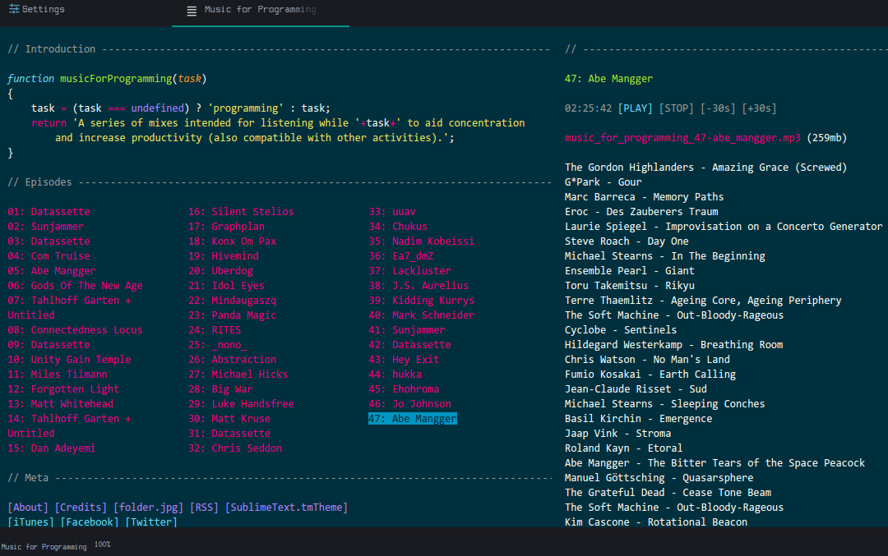

# Atom Music for Programming package

Opens a web browser in an editor and loads [Music for programming](http://musicforprogramming.net/) web page in Atom.

Super eavily inspired by [Atom Web View package](https://github.com/gabceb/atom-web-view).

## Three ways to use the Music for Programming package

Clone this repo in your Atom packages folder (or symlink it there).

### With command Palette

1. `ctrl-shift-P` to open your **Command Palette**
2. type in "Music for Programming"
3. choose "Open" or "Toggle (F4)"

### Using Atom's Menu bar

1. Atom Menu Package
2. Music for Programming
3. Toggle (F4)

> Press Alt on windows if it's not there

### F4

F4 is set as default to toggle (open / close) the editor.

## Development

### Todo

Most likely, I will only update this package only to check if the page is already opened and loaded in Atom.

If you know how to do it, feel free to send a PR implementing the feature.

* Report all *bugs* and *feature* offered in the issues section on **github**
* If you would like to help out first fork the repository
```git
git clone https://github.com/max-devjs/atom-music-for-programming
git commit -am "<changelog>"
git add .
git push https://github.com/YOUR-GIT-USERNAME/atom-music-for-programming
```
* Launch atom in dev mode (open a folder with command palette)
* run `apm develop atom-music-for-programming`
* Make a pull requests

[Atom.io Documentation](https://atom.io/docs/)


